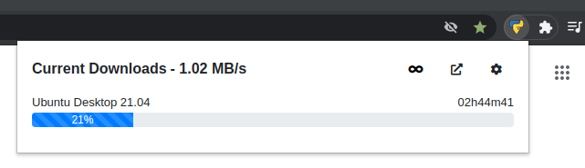
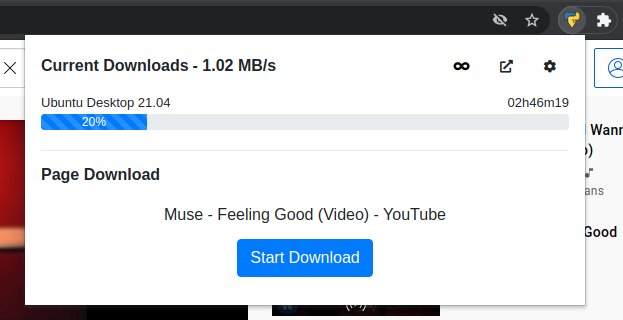

# Yape - Chrome Extension

Yape stands for **Yet Another PyLoad Extension**. It's a dead simple Chrome extension for monitoring and easily adding downloads to a [PyLoad](https://github.com/pyload/pyload) server.

Features:
- One-click download
- Monitor current downloads
- Monitor global bandwidth usage & one-click speed limiter

## Usage

Go to the option page by clicking on the `settings` icon and fill the IP address and the port of the `PyLoad` server. Click `Save` and then `Login` to enter your credentials.

> Note: The credentials are not stored on the browser, only the session cookie.  

The current downloads are always displayed.
If the current active tab has a downloadable file, an extra panel will be displayed with a button to start the download.

## Screenshots

