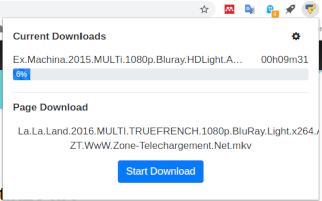
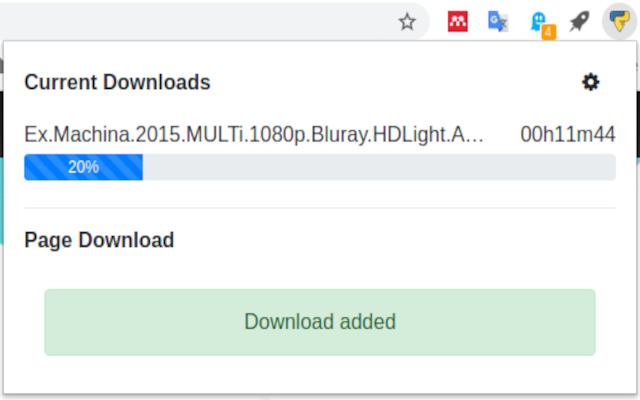
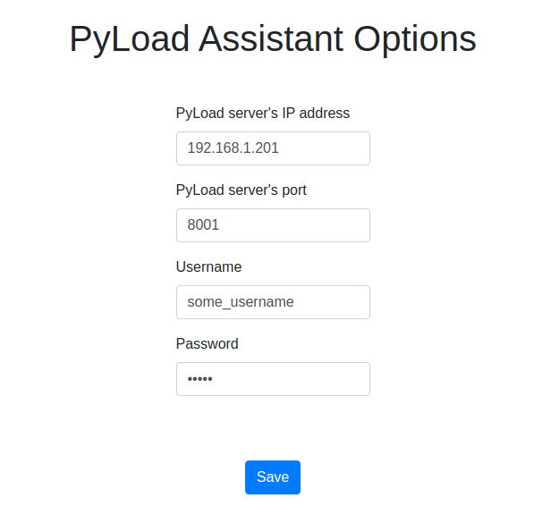

# PyLoad Assistant - Chrome Extension

This is a Chrome extension to monitor and easily add downloads to a [PyLoad](https://github.com/pyload/pyload) server.

## Usage

First makes sure that the IP address and the port of the `PyLoad` server are correctly set in the option page, as well as the user credentials.
These data will only be stored locally using the Chrome storage feature.

The current downloads are available from anywhere.
If the current active tab has a downloadable file, an extra panel will be displayed with a button to start the download.

## Screenshots

